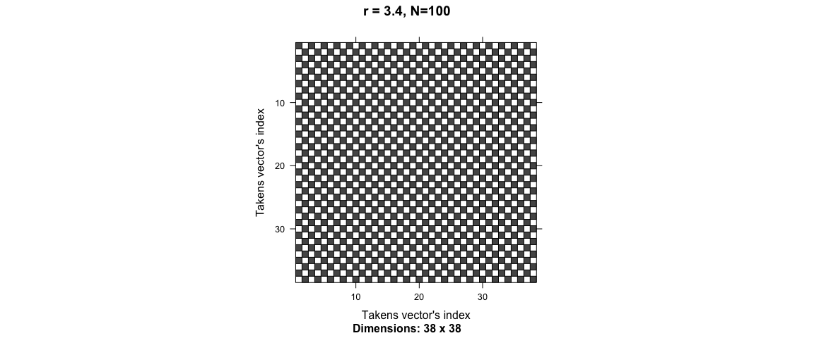
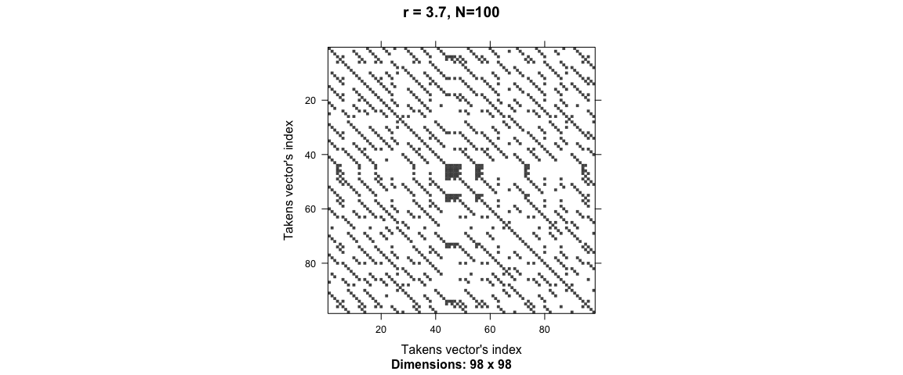

Logistic map: discrete dynamical systems
========================================

Most realistic systems with chaotic behavior, such as fluid flow around
an obstacle, are described by a non-linear partial differential
equation, which determines how the velocity changes in space and time.
We will see later in the course that chaos also occurs in many ordinary
(non-linear) differential equations. Here we will consider something
even simpler, an “iterative map”. This means that starting from an
initial value of a variable, *x*0 say, we generate a sequence
of values, *x*1, *x*2, etc. from the map
(i.e. function), *x**n* + 1 = *f*(*x**n*) where we
here make a simple choice
*f*(*x*) = 4*λ**x**n*(1 − *x**n*)
where *λ* is parameter. In other words,
*x*1 = 4*λ**x*0(1 − *x*0),
*x*2 = 4*λ**x*1(1 − *x*1), etc. We will
be interested in the behavior of successive iterations of this map, as a
function of the parameter *λ*. In particular we will study the behavior
of the *x**n* for large n.  
We consider *λ* in the range from 0 to 1, so, if *x*0 is
between 0 and 1, it is easy to see that all subsequent values of x also
lie in this range. In fact the largest value of *x**n* + 1
(which occurs for *x**n* = 1/2) is equal to *λ*.  
This so-called “logistic map” has been used as model for population
dynamics, but here we just treat it as a toy model which has a
transition to chaos.

The logistic map function for population growing is define following:  
*X**n* = *r**x*(1 − *x*)
Where *x* ∈ {0, 1}, represents the ratio of existing population to the
maximum possible population (1).  
*X**n* is the new population after *n* generations.  
*r* is the combined rate between reproduction and mortality.

Population for different *r* values
-----------------------------------

Poincaré phase diagram (self-similarity recurrence plot)
--------------------------------------------------------

Recurrence plot of the time series
----------------------------------

<a href="http://www.recurrence-plot.tk/glance.php" class="uri">http://www.recurrence-plot.tk/glance.php</a>

Further lectures:
-----------------

<a href="https://geoffboeing.com/2015/03/chaos-theory-logistic-map/" class="uri">https://geoffboeing.com/2015/03/chaos-theory-logistic-map/</a>  
<a href="http://www.kierandkelly.com/from-chaos-to-creativity/" class="uri">http://www.kierandkelly.com/from-chaos-to-creativity/</a>  
<a href="http://www.kierandkelly.com/what-is-chaos/logistic-map/" class="uri">http://www.kierandkelly.com/what-is-chaos/logistic-map/</a>

Extra: r for negative values
----------------------------

